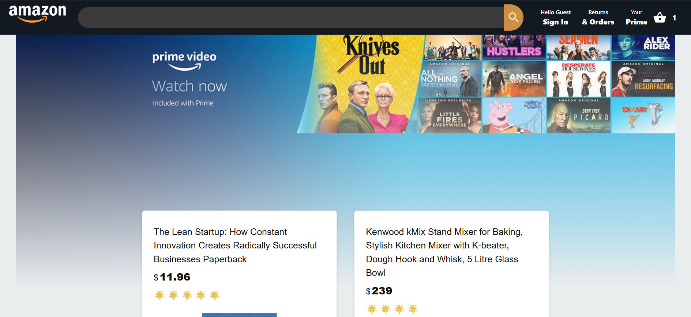
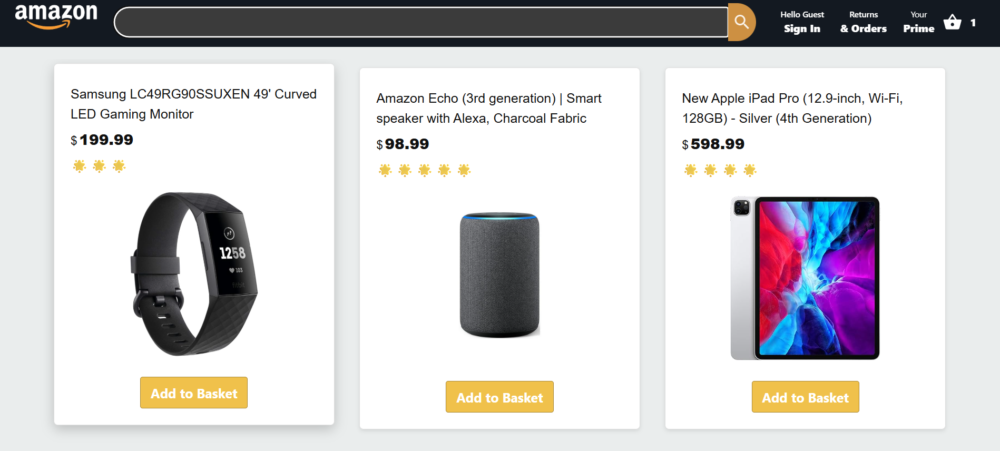
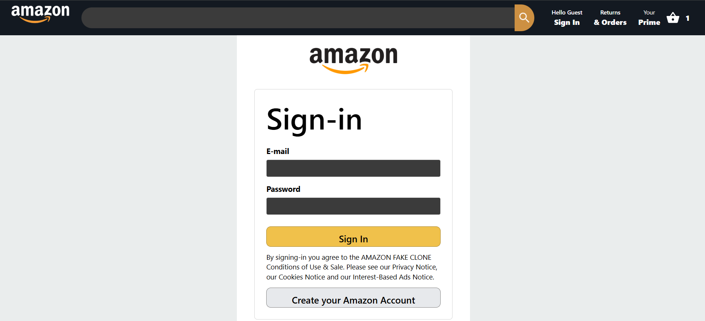

# AmaZon Clone 🛒

A sleek, fully functional **Amazon clone web app** built with **React** and **Firebase**.  
Browse products, add to cart, and experience a real-time, interactive e-commerce interface — all in a responsive, modern design.
It is a work in progress.

---

## 📸 Screenshots

### Home Page


### Dashboard


### Sign In Page


---

## 🌟 Features

- **User Authentication:** Sign up, login, and secure sessions with Firebase Authentication.  
- **Product Listings:** Dynamic product display with images, prices, and descriptions.  
- **Shopping Cart:** Add/remove products, view total cost, and manage your cart in real-time.  
- **Order Management:** Place and track orders with Firebase Firestore.  
- **Responsive Design:** Optimized for desktop, tablet, and mobile.  
- **Interactive UI:** Smooth transitions, modern layout, and React-based components.

---

## 💻 Tech Stack

- **Frontend:** React, JavaScript, CSS/Material UI/Tailwind  
- **Backend & Database:** Firebase Authentication, Firestore  
- **Build Tool:** Vite  

---

## 🚀 Getting Started

1. **Clone the repository**
```bash
git clone https://github.com/Paojangam/AmaZon-Clone.git
